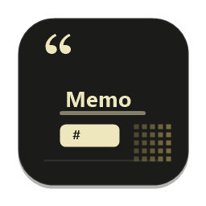
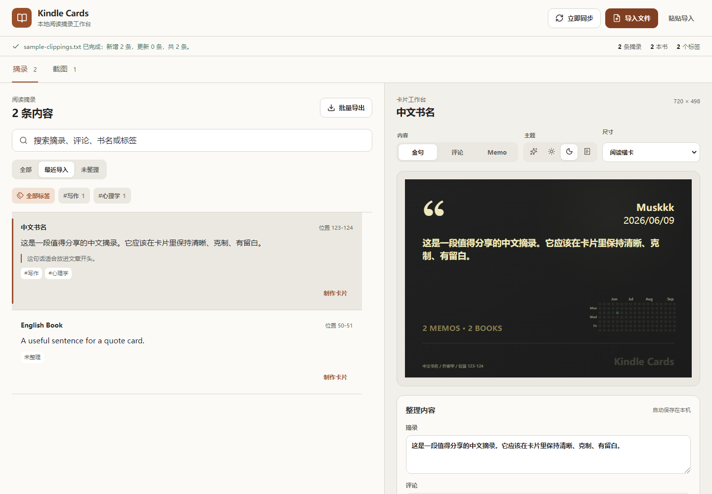
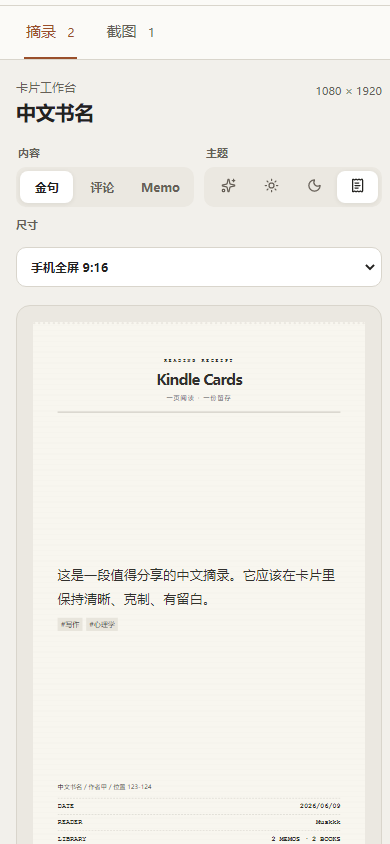

<div align="center">
  
  <h1>Kindle Cards</h1>
  <p><strong>Turn Kindle highlights into reading material you can organize, find, and share.</strong></p>
  <p>Local first · No account · Portable on Windows</p>
  <p>
    <a href="https://github.com/muskkkyang/kindle-cards/releases/latest">Download for Windows</a>
    · <a href="./CHANGELOG.md">Changelog</a>
    · <a href="./README.md">简体中文</a>
  </p>
  <p>
    <a href="https://github.com/muskkkyang/kindle-cards/actions/workflows/ci.yml"></a>
    <a href="https://github.com/muskkkyang/kindle-cards/releases/latest"></a>
    <a href="./LICENSE"></a>
  </p>
</div>



Kindle Cards brings Kindle highlights, notes, and screenshots into one focused local workflow. Connect a device or import a file, search and refine the material, then export portable text, polished PNG cards, or a batch ZIP.

> Your reading data stays on your computer. Kindle Cards requires no account or cloud service and includes no analytics, ads, or automatic uploads.

## From highlight to card

| 01 · Bring it back                                                                                   | 02 · Make it yours                                                                                         | 03 · Export and share                                                                   |
| ---------------------------------------------------------------------------------------------------- | ---------------------------------------------------------------------------------------------------------- | --------------------------------------------------------------------------------------- |
| Find a drive-letter or Windows MTP/WPD Kindle automatically, or import and paste `My Clippings.txt`. | Search titles and text, edit comments and tags, and reconcile repeated syncs without losing local changes. | Copy portable note text or export quote, comment, and memo cards as PNG or a batch ZIP. |

While the page is visible, Kindle Cards checks the device and content revision every five seconds. It performs an incremental merge only when `My Clippings.txt` has changed.

## Built for what happens after reading

| Reading library                                                                              | Card studio                                                   |
| -------------------------------------------------------------------------------------------- | ------------------------------------------------------------- |
| Parse Chinese and English titles, authors, pages, locations, highlights, notes, and hashtags | Quote, comment, and memo content modes                        |
| Reconcile edited Kindle notes and keep the more complete version                             | Paper, light, dark, and receipt themes                        |
| Search locally, filter by tags, edit, and autosave                                           | Reading landscape, 1:1, 3:4, wide, and full-screen 9:16 sizes |
| Deduplicate screenshots by content and retain edit history                                   | Single PNG and batch ZIP export                               |

### A complete mobile workspace

| Library                                                                                  | Full-screen receipt card                                                                            |
| ---------------------------------------------------------------------------------------- | --------------------------------------------------------------------------------------------------- |
|  |  |

On narrow screens, the library and card studio become separate views with an unobstructed bottom switcher. Full-screen cards export at a fixed `1080 × 1920`, ready for mobile publishing.

### Kindle screenshots, in the same workflow

Kindle Cards discovers PNG/JPEG images in the Kindle root, `screenshots`, and `documents/screenshots` folders. Local uploads are supported as well.

- Originals remain intact; cropping and captions are non-destructive edits.
- Windows OCR uses installed system languages. Results remain editable before they are copied or added to a card.
- Originals and additive edit revisions live in `data/screenshots/`; `KINDLE_CARDS_DATA_DIR` can point new assets elsewhere.
- Manual imports accept images up to 20 MB, and OCR always reads the complete original.

## Quick start

### Portable Windows build

1. Download `kindle-cards-*-windows-x64.zip` from [Releases](https://github.com/muskkkyang/kindle-cards/releases/latest).
2. Extract it somewhere you intend to keep it.
3. Double-click `Kindle Cards.cmd`.

The package includes its runtime and production dependencies. Node.js, Git, and npm are not required. Import [`sample-clippings.txt`](./sample-clippings.txt) to try the complete workflow without a Kindle.

### Run from source

Install [Node.js 22.22.2 or newer](https://nodejs.org/), then run:

```powershell
git clone https://github.com/muskkkyang/kindle-cards.git
cd kindle-cards
npm ci
npm run dev
```

Open `http://127.0.0.1:4310`. On Windows, the repository launcher is also available:

```powershell
powershell -ExecutionPolicy Bypass -File .\launch.ps1
```

It validates Node.js, installs locked dependencies, builds when needed, and selects a free port from `4310-4319`. To create a desktop shortcut, run:

```powershell
powershell -ExecutionPolicy Bypass -File .\create-desktop-shortcut.ps1
```

The script preserves an existing shortcut unless `-Force` is supplied.

## Add comments and tags on Kindle

Write a note directly on Kindle:

```text
#writing #psychology This line belongs in the opening paragraph.
```

After sync, Kindle Cards separates it into the original highlight, a clean comment, and the `writing` and `psychology` tags.

## Data and privacy

| Data                                     | Default location                   | Behavior                                                                              |
| ---------------------------------------- | ---------------------------------- | ------------------------------------------------------------------------------------- |
| Highlights, comments, tags, and settings | Current browser `localStorage`     | Never uploaded automatically; changing the browser origin or port does not migrate it |
| Kindle screenshots and edit history      | `data/screenshots/` beside the app | Originals and each edit revision are stored separately                                |
| MTP/WPD snapshots                        | System temporary directory         | Read-only copy removed immediately after parsing                                      |

The page and local API listen only on `127.0.0.1`. The service reads Kindle's `My Clippings.txt` and discoverable screenshots only during an import or while the page is visible. It does not expose the full device path to the browser. Copying note text writes only to the local clipboard.

Browser-local storage is not a backup. Keep the original `My Clippings.txt` and back up the complete `data` directory before upgrading.

## Development and verification

```powershell
npm ci
npm run check
```

The quality gate runs ESLint, TypeScript, unit tests, UI tests, a production build, and Prettier verification.

| Command                        | Purpose                                             |
| ------------------------------ | --------------------------------------------------- |
| `npm run dev`                  | Start the local development service                 |
| `npm run test`                 | Run parser, service, storage, and UI tests          |
| `npm run typecheck`            | Check TypeScript types                              |
| `npm run build`                | Build production assets                             |
| `npm run package:portable:win` | Build the Windows x64 portable ZIP and SHA-256 file |

See the [architecture](./docs/ARCHITECTURE.md), [V1.x iteration and acceptance notes](./docs/V1.x-iterations.md), [contributing guide](./CONTRIBUTING.md), and [security policy](./SECURITY.md) for details.

## License

[MIT](./LICENSE)
