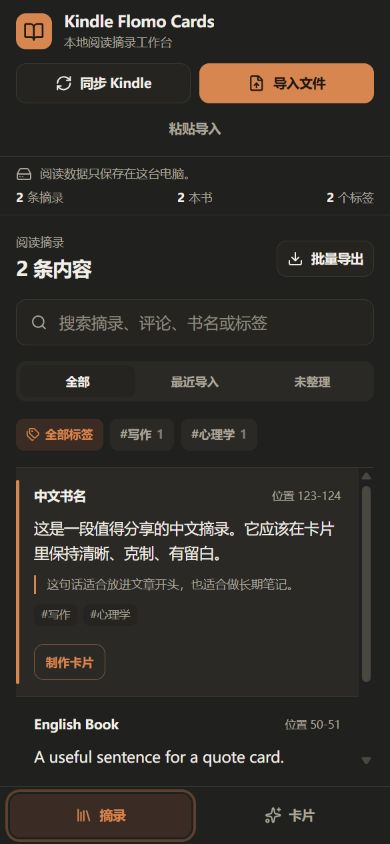
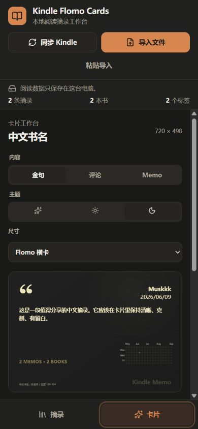

# Kindle Cards

[简体中文](./README.md)

[](https://github.com/muskkkyang/kindle-cards/actions/workflows/ci.yml)
[](https://github.com/muskkkyang/kindle-cards/releases/latest)
[](./LICENSE)

A local-first workspace for turning Kindle highlights into searchable notes, portable text, and shareable image cards.

| Library                                                        | Card workspace                                                    |
| -------------------------------------------------------------- | ----------------------------------------------------------------- |
|  |  |

## What it does

- Finds `My Clippings.txt` on a USB-connected Kindle or imports it manually.
- Parses Chinese and English titles, authors, locations, pages, highlights, notes, and hashtags.
- Reconciles repeated imports and edited Kindle notes without producing duplicate drafts.
- Keeps search, filters, edits, and settings in browser-local storage.
- Copies a selected highlight as portable plain text.
- Exports quote, comment, and memo cards in several social formats.
- Packages batch exports into one ZIP download.
- Supports system light and dark modes, keyboard focus, reduced motion, and mobile layouts.

No account, cloud service, API key, analytics, or telemetry is required.

## Quick start

### Portable Windows download: no setup required

Download `kindle-cards-*-windows-x64.zip` from [Releases](https://github.com/muskkkyang/kindle-cards/releases/latest), extract it, then double-click `Kindle Cards.cmd`. The package includes its runtime and production dependencies; Node.js, Git, and npm are not required.

### Run from source

Install [Node.js 22.22.2 or newer](https://nodejs.org/), then run:

```powershell
git clone https://github.com/muskkkyang/kindle-cards.git
cd kindle-cards
npm ci
npm run dev
```

Open `http://127.0.0.1:4310`. You can import `sample-clippings.txt` to try the full workflow without a Kindle.

## Windows launcher

```powershell
powershell -ExecutionPolicy Bypass -File .\launch.ps1
```

The launcher validates Node.js, installs locked dependencies, builds when needed, finds a free port from `4310-4319`, and uses a build fingerprint to avoid reopening an outdated server.

To create a desktop shortcut:

```powershell
powershell -ExecutionPolicy Bypass -File .\create-desktop-shortcut.ps1
```

The script does not overwrite an existing shortcut unless `-Force` is supplied.

## Privacy

- The app and API listen on `127.0.0.1` only.
- Reading data stays in browser-local storage.
- The server reads only Kindle's `My Clippings.txt` file.
- The API does not expose the full local device path to the page.
- Copying note text only writes to the local clipboard and never sends it to an external service.

Browser-local storage is not a backup. Keep the original clipping file or another independent copy of important notes.

## Development

```powershell
npm ci
npm run check
```

The quality gate runs ESLint, TypeScript, unit and UI tests, the production build, and Prettier verification.

Create the portable Windows package with `npm run package:portable:win`. It verifies the downloaded Node.js runtime with its official SHA-256 checksum and emits both ZIP and `.sha256` files. The script stops when an output already exists; use `./scripts/build-portable-win.ps1 -Force` only when you intend to replace it.

See [docs/ARCHITECTURE.md](./docs/ARCHITECTURE.md), [CONTRIBUTING.md](./CONTRIBUTING.md), and [SECURITY.md](./SECURITY.md) for project details.

## License

[MIT](./LICENSE)
